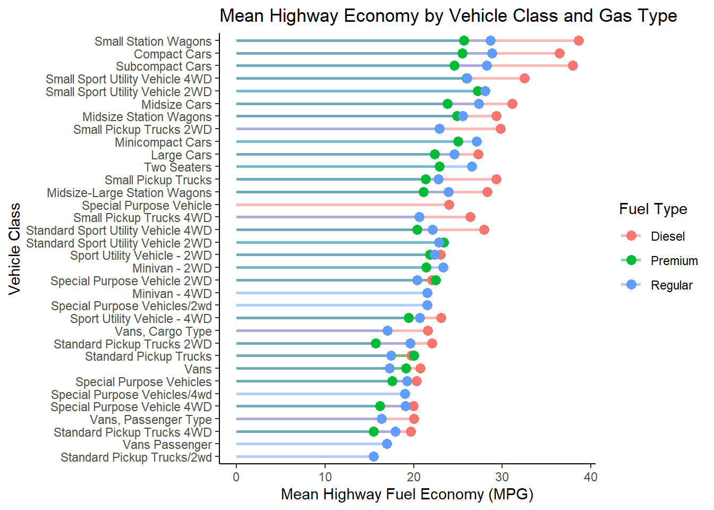
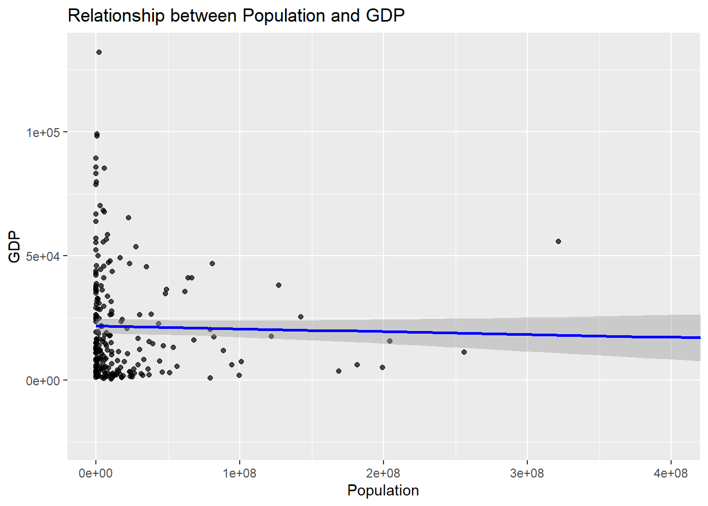
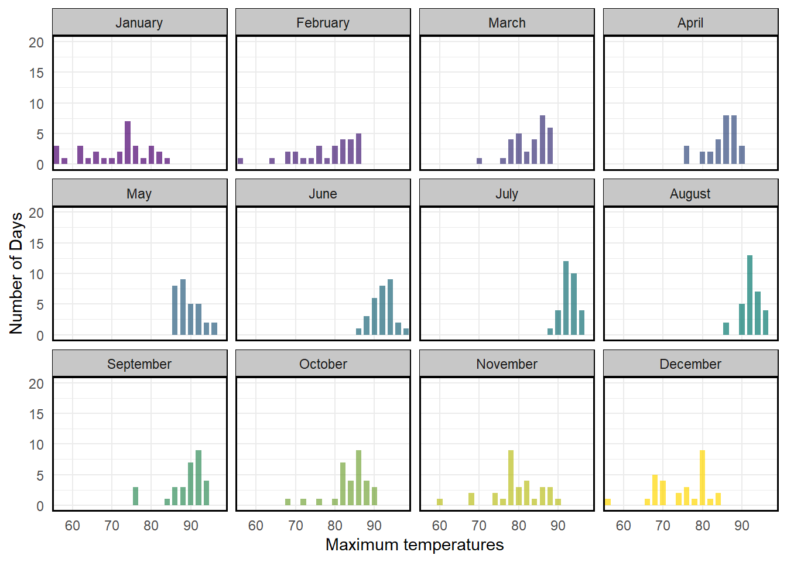

# Data Visualization and Reproducible Research

> Logan Lloyd

The following is a sample of products created during the _"Data Visualization and Reproducible Research"_ course.

## Project 01

In the `project_01/` folder you can find a full breakdown of the different most common fuel types used in commuter vehicles today. The fuels in question being regular gasoline, premium gasoline, and diesel fuel. The graphics shown are the progression of fuel economy by fuel type over the course of the years, average fuel economy by car class, and average fuel economy by vehicle class by fuel type. These graphics aim to help a reader make an informed decision on a vehicle by looking at the fuel it utilizes. 

**Sample data visualization:** 

## Project 02

In this project, I explored different country statistics via CIACountries. This data set shows items like GDP, oil production, population, etc. Using these, I explored the corrolation between population and GDP extensively using a interactive plot, spatial plot, and visualization of a linear fit model. What a discover is a phenomenon called population bloat in which some countries have noticably high populations but the GDP does not reflect it. Find the code and report in the `project_02/` folder.

**Sample data visualization:** 

## Project 03

In this project, I explored different reproducibility techniques with visualizations of data. In this document I had to utilize techniques gathered during the semester to attempt to reproduce the data visualizations presented to me. In addition I was asked to work with a text data set and create my own data visualization around it which was a unique experience as well.

**Sample data visualization:** 

### Moving Forward

In the future I plan to utilize what I have learned here to better my work in the field at my job. Knowing how to create visuals that not only look good but appeal to a consumer or boss is a skill I value highly. In addition, I plan to use these skills day to day as .csv files of data can be created by anyone and for my personal use I will be tracking things like weight loss with nice visuals. I never knew how important data storytelling was until this course and I can honestly say that taking this course has made me more conscious about how I present data and how I look at data sets and visualizations.