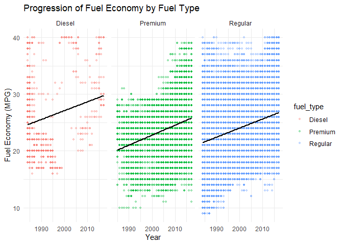
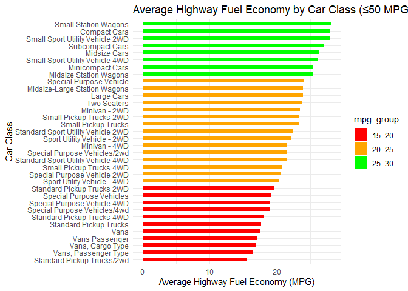
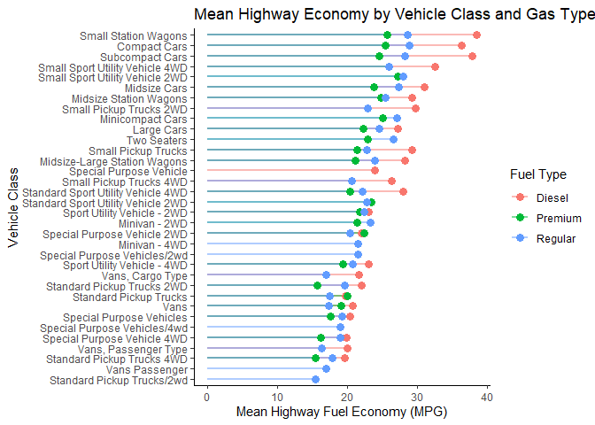

# Data Visualization 

> Logan Lloyd, llloyd8084@floridapoly.edu 

## Mini-Project 1

### Description

In this project it was asked that we take one of the provided data sets off of github and explore it while demonstrating skills using techniques used so far in this course. That being said, the data set selected was fuel.csv which sparked interest due to personal experience with that content in the description. What was found in the document was a plethora of additional information including vehicle type, id, year, make, model, etc. This only worked to benefit the data's exploration. The goal of this project is to explore the fuel economy through 1990 to 2017. The reason for this is understanding what type of fuel has the most longevity has always been an inner family debate and topic of discussion from friends who are looking for cost effective vehicles, this data set can settle it once and for all. In short, diesel has the highest fuel economy between itself, premium gasoline, and regular gasoline. This came as a surprise as I was under the impression premium gasoline was not only better for your engine but also better on mileage.

### Introduction

As stated previously, it was asked that we explore a provided data set with our knowledge accrued over the first several weeks of this course. Three pieces of data visualization were required as a summary of the data chosen. The data chosen to summarize was fuel.csv which constitutes a full breakdown of vehicles through the years 1990 to 2017 and everything related to the fuel economy on them. This includes make, model, year, transmission type, id, highway mileage, engine type, etc. While extensive, not all of the data needed to be looked at. What was focus in on was highway fuel economy, year, class of the vehicle, and fuel type. With fuel type, the focus was on regular and premium gasoline as well as diesel fuel. These are the most commonly talked about and used fuels by normal people which is why they were the focus. It is important to note here that there are massive gaps in the data sets which means the results shown may not be one hundred percent accurate, however, with the data provided there is enough of a sampling to tell a story.

### Process Breakdown

The process for this project was more complicated than expected as I did not quite know what data to select to showcase fuel economy. I eventually settled on year, class, and the specific types of fuel I wanted to observe. The data a started with was MPG versus year where points where colored based on fuel type. Using these I started with a simple scatter plot and realized there would be too much data clustered together for any reader to understand what was going on, so I split the graphic into three separate sub-graphs. Each of these were centered around the fuel type while year and MPG stayed the same.Then for clarity I added a trend line displaying the average fuel economy per year. In addition, I limited the y-axis to 40 MPG or less to cast out clusters of outliers that would have distracted from the main data.This graphic shows the steady rise in average fuel efficiency for every kind of fuel and shows that diesel fuel has a higher efficiency on average then gasoline. An important note here is that there are many gaps in both diesel and premium fuel, primarily in diesel and more likely than not the average would shift given that all of the blanks were to be filled in. 

``` r
library(tidyverse)
```

```
## ── Attaching core tidyverse packages ──────────────────────── tidyverse 2.0.0 ──
## ✔ dplyr     1.1.4     ✔ readr     2.1.5
## ✔ forcats   1.0.0     ✔ stringr   1.5.1
## ✔ ggplot2   3.5.2     ✔ tibble    3.2.1
## ✔ lubridate 1.9.4     ✔ tidyr     1.3.1
## ✔ purrr     1.0.4     
## ── Conflicts ────────────────────────────────────────── tidyverse_conflicts() ──
## ✖ dplyr::filter() masks stats::filter()
## ✖ dplyr::lag()    masks stats::lag()
## ℹ Use the conflicted package (<http://conflicted.r-lib.org/>) to force all conflicts to become errors
```

``` r
fuel_eco <- read_csv("https://raw.githubusercontent.com/aalhamadani/datasets/refs/heads/main/fuel.csv")
```

```
## Rows: 38113 Columns: 81
## ── Column specification ────────────────────────────────────────────────────────
## Delimiter: ","
## chr (11): make, model, class, drive, transmission, transmission_type, engine...
## dbl (59): vehicle_id, year, engine_index, engine_cylinders, engine_displacem...
## lgl (11): turbocharger, supercharger, fuel_type_2, gas_guzzler_tax, start_st...
## 
## ℹ Use `spec()` to retrieve the full column specification for this data.
## ℹ Specify the column types or set `show_col_types = FALSE` to quiet this message.
```

``` r
fuel_eco %>%
  filter(fuel_type %in% c("Diesel", "Premium", "Regular"), highway_mpg_ft1 <= 40) %>%
  ggplot(aes(x = year, y = highway_mpg_ft1, color = fuel_type)) +
    geom_point(alpha = 0.3, size = 1) +
    geom_smooth(method = "lm", se = FALSE, linewidth = 1, color = "black") +
    facet_wrap(~fuel_type) +
    labs(title = "Progression of Fuel Economy by Fuel Type", x = "Year", y = "Fuel Economy (MPG)") +
    theme_minimal()
```

```
## `geom_smooth()` using formula = 'y ~ x'
```

<!-- -->

Next I wanted to explore vehicle classes in relation to fuel economy and my initial idea was to use a bar chart. This ended with me using the geom_col function so I could corrolate the MPG to the car class directly. The car class on the x-axis was too cluttered so I moved it to the y instead. This plot shows the trend lines from the first plot combined and demonstrates the effectiveness of some size cars to  other in terms of fuel economy with specific color coding. 

``` r
fuel_eco %>%
  filter(highway_mpg_ft1 <= 50) %>%
  group_by(class) %>%
  summarize(mean_highway_mpg = mean(highway_mpg_ft1, na.rm = TRUE)) %>%
  mutate(mpg_group = case_when(mean_highway_mpg < 20 ~ "15–20", mean_highway_mpg < 25 ~ "20–25", mean_highway_mpg < 30 ~ "25–30", TRUE ~ ">30")) %>%
  ggplot(aes(x = reorder(class, mean_highway_mpg), y = mean_highway_mpg, fill = mpg_group)) +
    geom_col(width = 0.5) +
    coord_flip() +
    scale_fill_manual(values = c ("15–20" = "red","20–25" = "orange","25–30" = "green",">30" ="blue")) +
    labs(title = "Average Highway Fuel Economy by Car Class (≤50 MPG)",x = "Car Class", y = "Average Highway Fuel Economy (MPG)") +
    theme_minimal()
```

<!-- -->

The third and final plot is a build on the previous. I knew I wanted to use a lollipop plot somewhere and this point seemed ideal as the different fuel types were not represented on the bar chart. Perhaps there were some classes of vehicles with low averages for regular fuel but high for diesel? This graphic explores that question and shows that there are indeed some classes of vehicles that retain low gasoline averages but high diesel averages.

``` r
fuel_eco %>%
  filter(fuel_type %in% c("Diesel", "Regular", "Premium"), highway_mpg_ft1 <= 50) %>%
  group_by(class, fuel_type) %>%
  summarize(mean_highway_mpg = mean(highway_mpg_ft1, na.rm = TRUE)) %>%
  ggplot(aes(x = mean_highway_mpg, y = reorder(class, mean_highway_mpg), color = fuel_type)) +
    geom_segment(aes(x = 0, xend = mean_highway_mpg, yend = reorder(class, mean_highway_mpg)), size = 1, alpha = 0.5) +
    geom_point(size = 3) +
    labs(title = "Mean Highway Economy by Vehicle Class and Gas Type", x = "Mean Highway Fuel Economy (MPG)", y = "Vehicle Class", color = "Fuel Type") +
    theme_classic()
```

```
## `summarise()` has grouped output by 'class'. You can override using the
## `.groups` argument.
```

```
## Warning: Using `size` aesthetic for lines was deprecated in ggplot2 3.4.0.
## ℹ Please use `linewidth` instead.
## This warning is displayed once every 8 hours.
## Call `lifecycle::last_lifecycle_warnings()` to see where this warning was
## generated.
```

<!-- -->


### Conclusions

What these data visualizations are supposed to showcase is a quick reference guide to cars with budget fuel economies which shows that smaller vehicles generally have better mileage but diesel fuel if the superior fuel type. Weighing these when searching for a vehicle are certainly good things and these graphics provide a summary for that available data. Some principles of data visualization that were fulfilled within this project are elimination of chart clutter. There is still room for improvement but the major rules were followed in this regard as the graphs do not bear any unnecessary design choices or decorations.In addition, the choices in graphic designs was thoroughly thought out to provide the most straightforward graphic with minimal effort on the reader to see what the data says. Attention to positioning and symmetry was also heavily considered (Top left first, then left to right). While there are still improvements to be made on these graphics, they convey the data directly and effectively which was the overarching goal.


