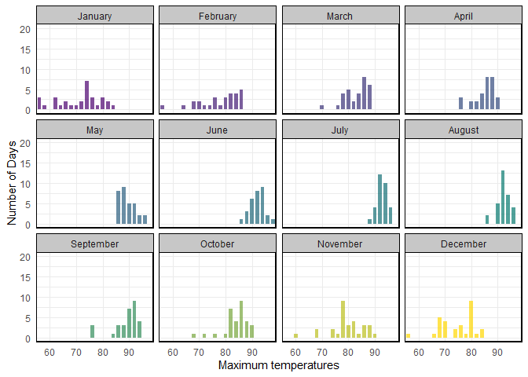
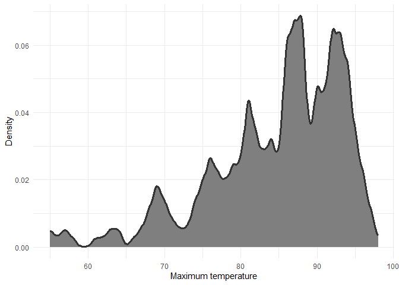
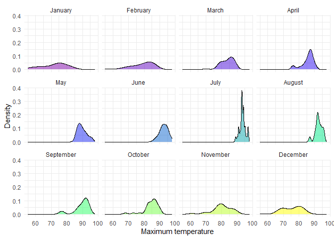
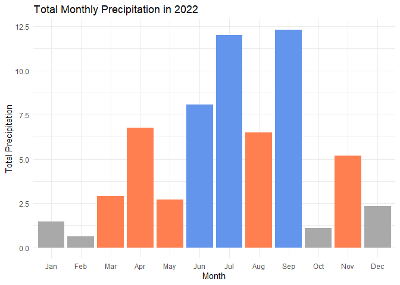
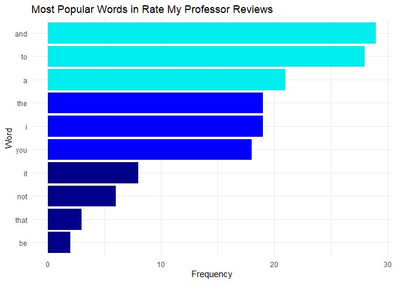

``` r
library(tidyverse)
```

```
## ── Attaching core tidyverse packages ──────────────────────── tidyverse 2.0.0 ──
## ✔ dplyr     1.1.4     ✔ readr     2.1.5
## ✔ forcats   1.0.0     ✔ stringr   1.5.1
## ✔ ggplot2   3.5.2     ✔ tibble    3.2.1
## ✔ lubridate 1.9.4     ✔ tidyr     1.3.1
## ✔ purrr     1.0.4     
## ── Conflicts ────────────────────────────────────────── tidyverse_conflicts() ──
## ✖ dplyr::filter() masks stats::filter()
## ✖ dplyr::lag()    masks stats::lag()
## ℹ Use the conflicted package (<http://conflicted.r-lib.org/>) to force all conflicts to become errors
```

``` r
weather_tpa <- read_csv("https://raw.githubusercontent.com/aalhamadani/datasets/master/tpa_weather_2022.csv")
```

```
## Rows: 365 Columns: 7
## ── Column specification ────────────────────────────────────────────────────────
## Delimiter: ","
## dbl (7): year, month, day, precipitation, max_temp, min_temp, ave_temp
## 
## ℹ Use `spec()` to retrieve the full column specification for this data.
## ℹ Specify the column types or set `show_col_types = FALSE` to quiet this message.
```

``` r
sample_n(weather_tpa, 4)
```

```
## # A tibble: 4 × 7
##    year month   day precipitation max_temp min_temp ave_temp
##   <dbl> <dbl> <dbl>         <dbl>    <dbl>    <dbl>    <dbl>
## 1  2022     4    27             0       88       66     77  
## 2  2022    12    28             0       75       48     61.5
## 3  2022     9    29             0       77       65     71  
## 4  2022    11    18             0       69       52     60.5
```


``` r
library(ggplot2)

weather_tpa$month <- factor(weather_tpa$month, labels = month.name[1:12])

weather_filtered <- subset(weather_tpa, max_temp >= 55 & max_temp <= 100)

weather_filtered$max_temp_bin <- cut(weather_filtered$max_temp, breaks = seq(55, 100, by = 2), include.lowest = TRUE)

custom_palette <- colorRampPalette(c("#4b006e", "#2D5A80", "#037c6e", "#FFD700"))(12)

breaks <- levels(weather_filtered$max_temp_bin)[c(3, 8, 13, 18)]
labels <- c("60", "70", "80", "90")

ggplot(weather_filtered, aes(x = max_temp_bin)) +
  geom_bar(aes(fill = month), width = 0.7, color = NA, alpha = 0.7) +
  scale_fill_manual(values = custom_palette) +
  labs(x = "Maximum temperatures", y = "Number of Days") +
  facet_wrap(~ month) +
  theme_minimal() +
  theme(panel.border = element_rect(color = "black", fill = NA, linewidth = 1), strip.background = element_rect(fill = "grey78"), legend.position = "none") +
  coord_cartesian(ylim = c(NA, 20)) +
  scale_x_discrete(breaks = breaks, labels = labels)
```

<!-- -->


``` r
library(ggplot2)

weather_filtered <- subset(weather_tpa, max_temp >= 55 & max_temp <= 100)

ggplot(weather_filtered, aes(x = max_temp, y = after_stat(density))) +
  geom_density(fill = "grey50", color = "grey20", alpha = 1, bw = 0.5, size = 1.25) +
  labs(x = "Maximum temperature", y = "Density") +
  theme_minimal()
```

```
## Warning: Using `size` aesthetic for lines was deprecated in ggplot2 3.4.0.
## ℹ Please use `linewidth` instead.
## This warning is displayed once every 8 hours.
## Call `lifecycle::last_lifecycle_warnings()` to see where this warning was
## generated.
```

<!-- -->


``` r
library(ggplot2)

weather_tpa$month <- factor(weather_tpa$month, labels = month.name[1:12])

weather_filtered <- subset(weather_tpa, max_temp >= 55 & max_temp <= 100)

custom_palette <- colorRampPalette(c("#7E03A8", "#1A11FF", "#00FF7F", "#FFFF00"))(12)

ggplot(weather_filtered, aes(x = max_temp, y = ..density.., fill = month)) +
  geom_density(alpha = 0.5) +
  scale_fill_manual(values = custom_palette) +
  labs(x = "Maximum temperature", y = "Density") +
  theme_minimal() +
  theme(legend.position = "none") +
  facet_wrap(~ month)
```

```
## Warning: The dot-dot notation (`..density..`) was deprecated in ggplot2 3.4.0.
## ℹ Please use `after_stat(density)` instead.
## This warning is displayed once every 8 hours.
## Call `lifecycle::last_lifecycle_warnings()` to see where this warning was
## generated.
```

<!-- -->


``` r
library(ggridges)
library(ggplot2)
library(viridis)
```

```
## Loading required package: viridisLite
```

``` r
weather_filtered$month <- factor(weather_filtered$month, levels = rev(month.name), labels = rev(month.name))

ggplot(weather_filtered, aes(x = max_temp, y = month, fill = after_stat(x))) +
  geom_density_ridges_gradient(quantile_lines = TRUE, quantiles = c(0.25, 0.5, 0.75), scale = 3, rel_min_height = 0.01) +
  scale_fill_viridis_c(name = "Temp. [F]", option = "plasma") +  # direction = 1 is default
  labs(x = "Maximum temperature (in Fahrenheit degrees)", y = NULL) +
  theme_minimal(base_size = 14) +
  theme(axis.text.y = element_text(size = 12))
```

```
## Picking joint bandwidth of 1.87
```

<!-- -->


``` r
library(tidyverse)

url <- "https://raw.githubusercontent.com/aalhamadani/datasets/master/tpa_weather_2022.csv"
weather_tpa <- read.csv(url)

weather_filtered <- subset(weather_tpa, precipitation != -99.99 & max_temp != -99.9 & min_temp != -99.9)

monthly_precip <- weather_filtered %>%
  group_by(month) %>%
  summarise(total_precip = sum(precipitation))

monthly_precip$month <- factor(monthly_precip$month, levels = 1:12, labels = month.abb[1:12])

monthly_precip <- monthly_precip %>%
  mutate(precip_cat = case_when(total_precip < 2.5 ~ "dark", total_precip >= 2.5 & total_precip < 7.5 ~ "light", total_precip >= 7.5 ~ "bright"))

custom_colors <- c("dark" = "darkgrey", "light" = "coral", "bright" = "cornflowerblue")

ggplot(monthly_precip, aes(x = month, y = total_precip, fill = precip_cat)) +
  geom_bar(stat = "identity") +
  scale_fill_manual(values = custom_colors, guide = "none") +
  labs(title = "Total Monthly Precipitation in 2022", x = "Month", y = "Total Precipitation") +
  theme_minimal()
```

<!-- -->


``` r
library(tidytext)

data <- read_csv('https://raw.githubusercontent.com/aalhamadani/dataviz_final_project/main/data/rmp_wit_comments.csv')
```

```
## Rows: 18 Columns: 2
## ── Column specification ────────────────────────────────────────────────────────
## Delimiter: ","
## chr (2): course, comments
## 
## ℹ Use `spec()` to retrieve the full column specification for this data.
## ℹ Specify the column types or set `show_col_types = FALSE` to quiet this message.
```

``` r
all_text <- tolower(paste(data$comments, collapse = ' '))

selected_words <- c('be', 'i', 'you', 'the', 'a', 'to', 'it', 'not', 'that', 'and')
word_counts <- tibble(text = all_text) %>%
  unnest_tokens(word, text) %>%
  filter(word %in% selected_words) %>%
  count(word, sort = TRUE)

word_counts <- word_counts %>%
  mutate(color_cat = case_when(n < 10 ~ "dark", n >= 10 & n <= 20 ~ "light", n > 20 ~ "bright"))

custom_colors <- c("dark" = "blue4", "light" = "blue", "bright" = "cyan2")

word_counts %>%
  ggplot(aes(x = reorder(word, n), y = n, fill = color_cat)) +
  geom_col() +
  scale_fill_manual(values = custom_colors, guide = "none") +
  coord_flip() +
  labs(title = 'Most Popular Words in Rate My Professor Reviews', x = 'Word', y = 'Frequency') +
  theme_minimal()
```

<!-- -->

